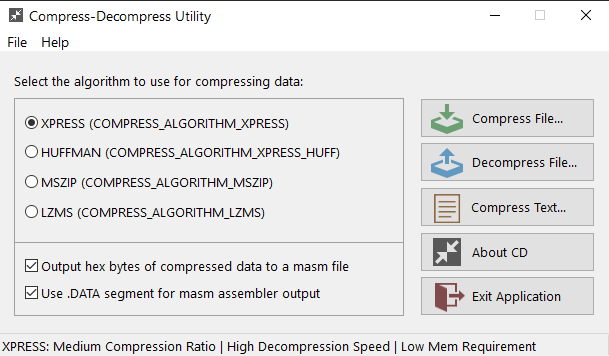

#  CD

**CD** - Compress-Decompress Utility using the Microsoft Compression API

**CD** uses the Microsoft Compression API to compress or decompress data using one of the four supported compression algorithms: **XPRESS**, **XPRESS with Huffman encoding**, **MSZIP** or **LZMS**.

The files compressed by **CD** using those compression algorithms also store a signature `DWORD` value as the header at the start of the file. This is so that the appropriate compression algorithm can be used for the decompression.

**CD** also makes use of the Microsoft Compression API to store bitmap resources as **LZMS** compressed data. There are two ways in which **CD** uses that compressed bitmap data: 

- In the about box, by uncompressing the bitmap data before creating the bitmap in memory. The **LZMS** compressed bitmap data is stored as static hex bytes in the `CD128x128x4.bmp.asm` file.

- Adding **LZMS** compressed bitmap files (`*.lzms`) as `RC_DATA` resources which are compiled into `CD.exe`. These resources are loaded into memory, and then uncompressed before creating the bitmaps in memory.

**CD** also allows an optional output of compressed data bytes as a masm `.asm` file with '`db`' data defines, similar to the [masm32 sdk](https://masm32.com/) utility **bin2dbex**.

**Note: the minimum version of windows to use for the Microsoft Compression API and thus to use the CD - Compress-Decompress Utility is [Windows 8](https://learn.microsoft.com/en-us/windows/win32/api/compressapi/nf-compressapi-compress#requirements)**

# Download

The latest x86 and x64 release can be downloaded via the [releases](https://github.com/mrfearless/cd/releases) section of this Github repository.

# Resources

For further information about the Microsoft Compression API, please refer to the following links:

- [Microsoft Compression Portal](https://learn.microsoft.com/en-us/windows/win32/cmpapi/-compression-portal)
- [Using The Microsoft Compression API](https://learn.microsoft.com/en-us/windows/win32/cmpapi/using-the-compression-api)
- [Compress Function](https://learn.microsoft.com/en-us/windows/win32/api/compressapi/nf-compressapi-compress)
- [Decompress Function](https://learn.microsoft.com/en-us/windows/win32/api/compressapi/nf-compressapi-decompress)